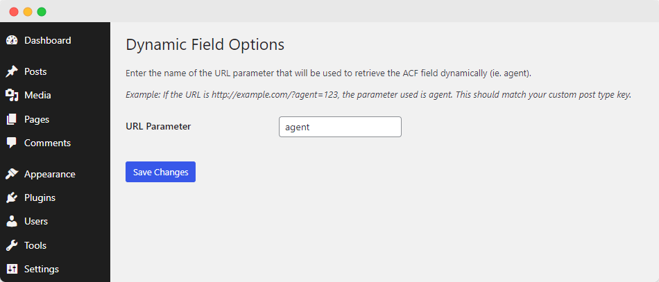

# ACF Dynamic Field Shortcode

This is a WordPress plugin that allows you to retrieve and display ACF (Advanced Custom Fields) custom field values using a shortcode for any post on any page.

## Installation

1. Download the plugin files.
2. Upload the plugin files to your `/wp-content/plugins/` directory, or install the plugin through the WordPress plugins screen directly.
3. Activate the plugin through the 'Plugins' screen in WordPress.

## Usage

After activating the plugin, you can use the shortcode to display ACF custom field values.

Example: [dynamic_field field="phone"]

URL -> https://example.com?broker=123

"This will output the phone field for a broker with a post_id of 123 on the page. The great thing is that you can run this shortcode on any page for any custom post type based on a dynamic value from a GET parameter, in this example, '?broker.'

The plugin also supports a dynamic parameter name using the plugin options.

## License

This project is licensed under the GPL-2.0 License - see the LICENSE file for details.